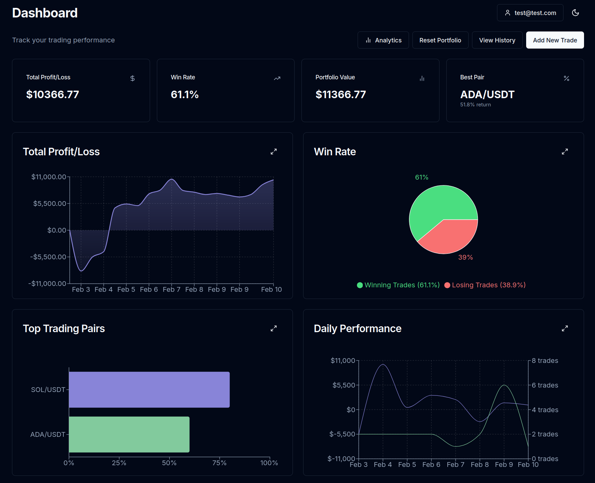

# Trade Pad

Trade Pad is a minimalist yet powerful trading journal that helps you track and analyze your trades.



## Features

- **Trade Tracking**: Easily log and manage your crypto trades across multiple trading pairs
- **Portfolio Overview**: Real-time visualization of your portfolio value and performance
- **Performance Analytics**: 
  - Win rate analysis
  - Daily P&L tracking
  - Top performing pairs
  - Trade statistics
- **Trade History**: Comprehensive history of all your trades with detailed metrics

## Tech Stack

- **Frontend**: Next.js, TypeScript, Tailwind CSS
- **Backend**: Node.js, Express, TypeScript
- **Database**: PostgreSQL with Prisma ORM

## Getting Started

1. Install dependencies:

```bash
npm install

npm run install-deps
```

2. Create .env files and fill the content:

```bash
cp ./frontend/.env.example ./frontend/.env

cp ./backend/.env.example ./backend/.env
```

3. Create database:
```bash
psql -U postgres

CREATE DATABASE trade_pad;

\q
```

4. Run migrations:
```bash
cd backend

npx prisma migrate dev
```

5. Run the app:

```bash
npm run start
```

## Getting Started (with Docker)

1. Create .env.docker files and fill the content:

```bash
cp ./frontend/.env.docker.template ./frontend/.env.docker

cp ./backend/.env.docker.template ./backend/.env.docker

cp ./db/.env.docker.template ./db/.env.docker
```

2. Run the compose file:
```bash
docker-compose up --build
```
